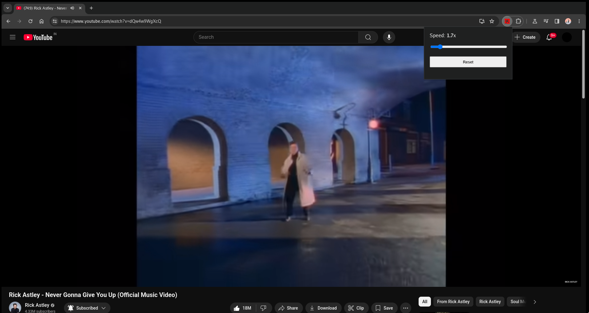

# ⚡ YouTube Speed Slider Adjuster

A minimalist browser extension that adds a custom **speed slider** to YouTube, allowing playback speeds from **0.1x to 16x** — way beyond YouTube’s default limits.

## 🎯 Features

- 📈 Adjustable speed from `0.1x` to `16x`  
- 🧭 Slider UI 
- 🔄 Real-time speed update — no reload required  
- 🧩 Lightweight and works seamlessly in the background  

## 🛠️ Installation

1. Clone or download this repository:
   ```bash
   git clone https://github.com/jerrygoodboi/yt_speed_slider
2. Open Chrome and go to: chrome://extensions/

3. Enable Developer mode (toggle in the top right).

4. Click Load unpacked and select the project folder.

5. Visit any YouTube video and enjoy precise speed control!


